# 푸른 : 아이와 함께 성장하는 화분
> 삼성 청년 SW 아카데미 (SSAFY) 10기 공통 PJT  
> 식물상태 정보 제공 및 아이와 소통이 가능한 스마트 화분  
> 2024.01.08 ~ 2024.02.16 (6주)  
> [🔗 푸른 Notion 바로가기](https://pengisblue.notion.site/E101-132c697bfe734b22b0640fc0aaec8c80?pvs=4)

## 1. 서비스 소개
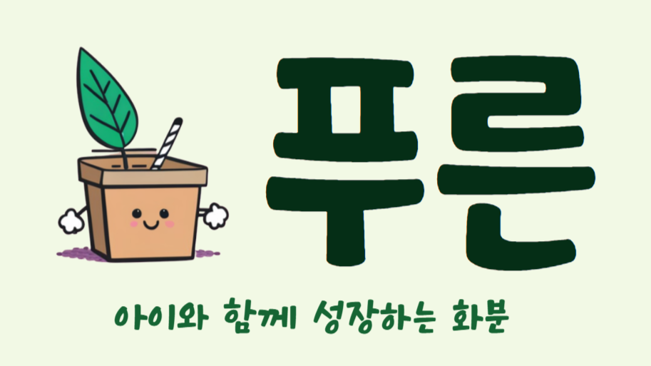

### 1.1 아이와 대화하기
호출어 ("푸른아!")로 푸른이를 부를 수 있습니다. 

안내음이 들린 뒤 말을 걸면, 푸른이가 친절하게 대답해줍니다. 응답을 들은 뒤 다시 말을 걸어 대화를 이어갈 수 있습니다. 

웹에서는 아이와 화분이 나눈 대화를 텍스트와 음성으로 확인할 수 있습니다.

### 1.2 온도, 습도 관리
화분을 등록하고 관리할 수 있습니다. 

현재의 온도, 습도와 어제의 상태를 그래프로 확인하고 관리할 수 있게 돕습니다. 

만약 등록한 식물이 적정 온도나 습도를 벗어나는 경우. 화분의 표정이 변화하여 간단하게 상태를 파악할 수 있습니다. 

### 1.3 기타 상호작용
가까이 다가가면 손을들어 인사해줍니다.! 
아주아주 귀엽습니다.

## 2. UCC
### [푸른이의 하루 보러가기!](https://youtu.be/fuwtwcdx7YY?si=M9KMLYXY5HIp1sCQ)
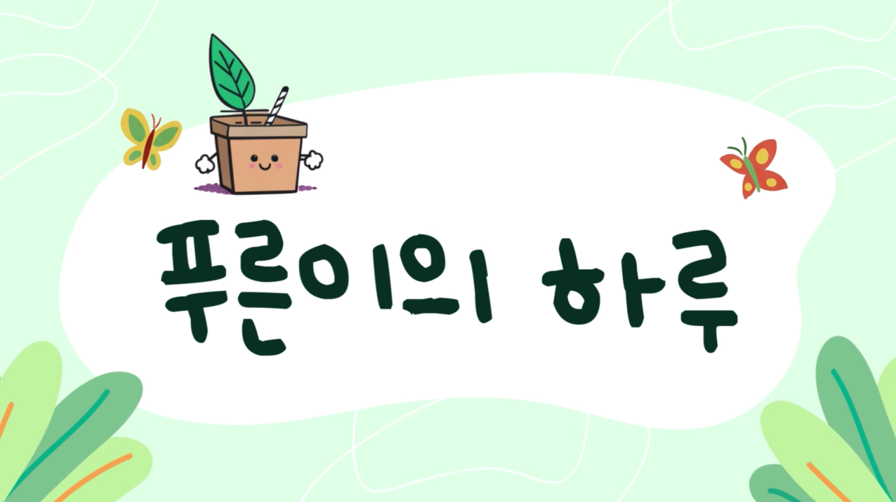

## 3. 화면구성
### 홈화면
|부모|키즈모드|
|:--:|:--:|
|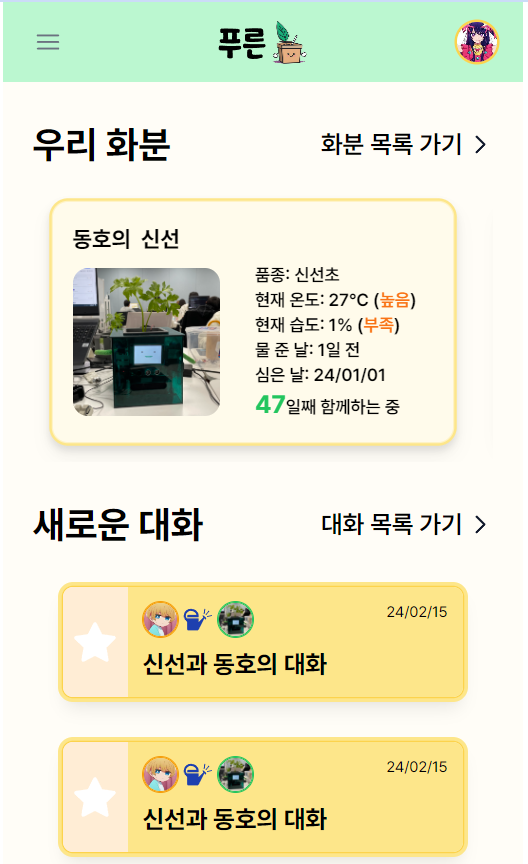|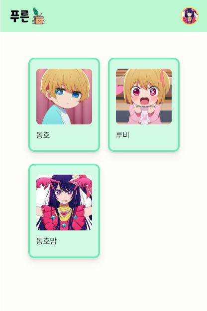|

### 화분 정보
|부모 - 화분목록|부모 - 화분상세|키즈모드 - 화분|
|:--:|:--:|:--:|
|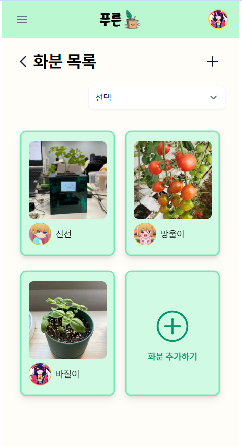|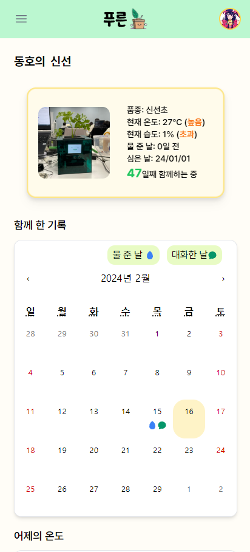|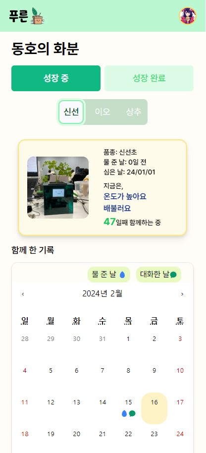|

### 아이 정보
|아이 목록|아이 상세|
|:--:|:--:|
|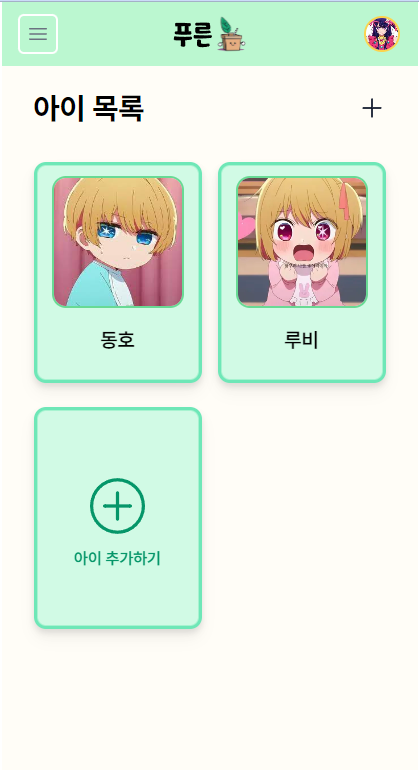|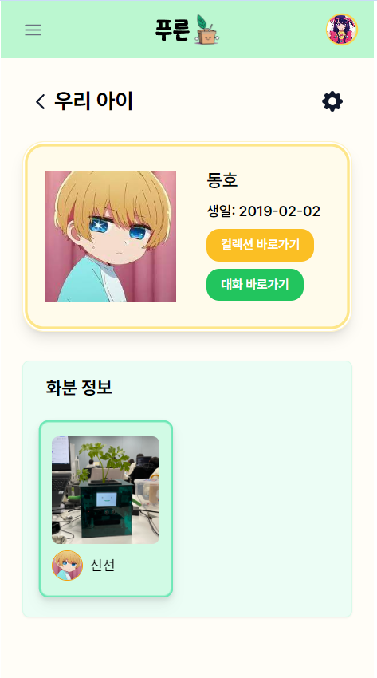|

### 대화
|대화 목록|대화 상세|
|:--:|:--:|
|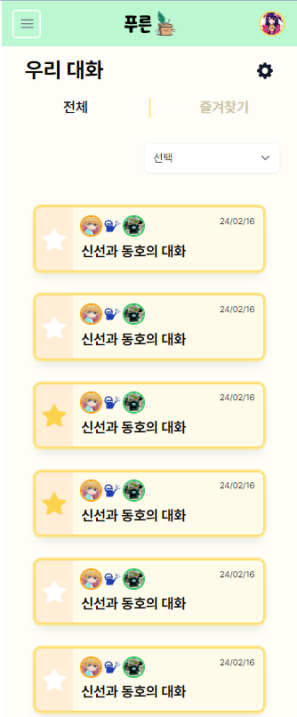|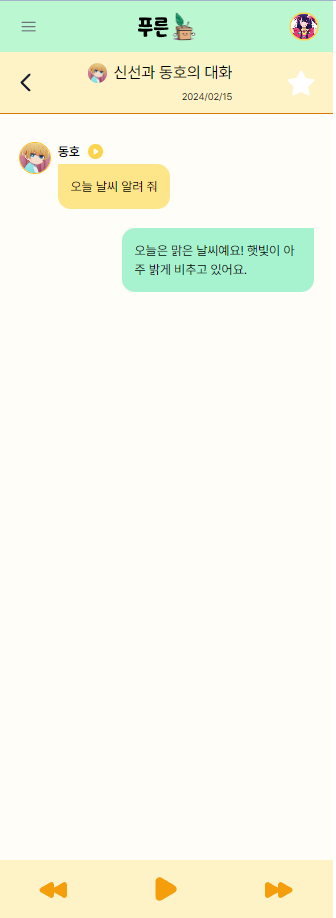|

### 컬렉션
|부모 - 컬렉션|키즈모드 - 컬렉션|
|:--:|:--:|
|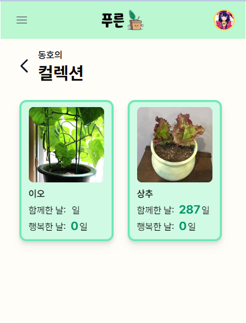 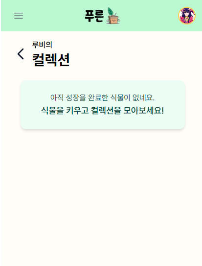|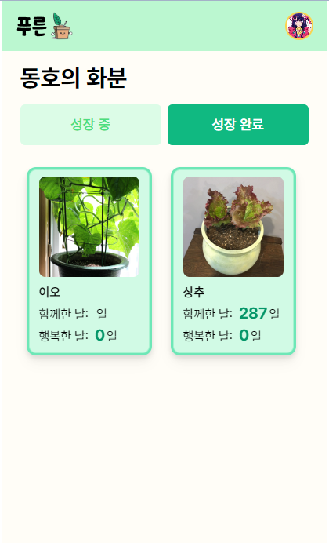|

## 4. 기술 소개

### 4.1 아키텍처
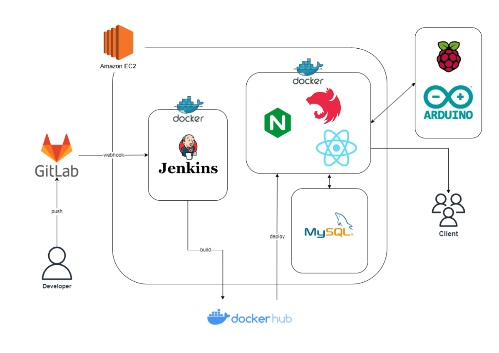

### 4.2 핵심 기술 - STT, TTS, 호출어 인식
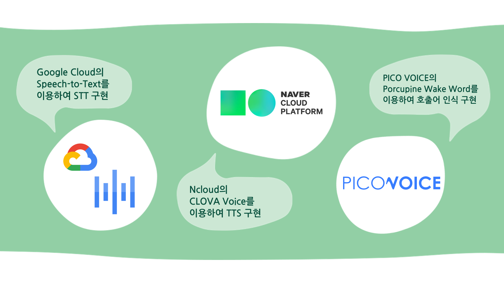

### 4.3 핵심 기술 - 통신 환경

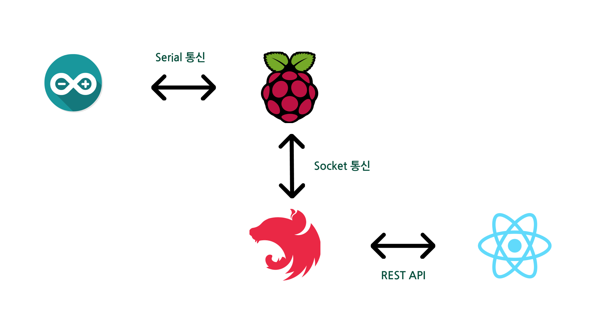

## 5. ERD

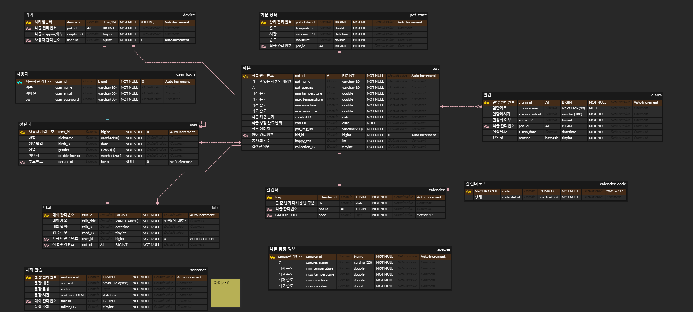

## 6. 팀소개

## 7. 기술 스택
### ⚙ Management Tool

### 💻 IDE

### 🔑 Infra

### 🥽 Embedded

### 📱 FrontEnd

### 📋 BackEnd

![typeorm](https://img.shields.io/badge/typeorm-3776AB.svg?&style=for-the-badge&logo=data:image/png;base64,iVBORw0KGgoAAAANSUhEUgAAADwAAAA2CAYAAACbZ/oUAAAAIGNIUk0AAHomAACAhAAA+gAAAIDoAAB1MAAA6mAAADqYAAAXcJy6UTwAAAAGYktHRAD/AP8A/6C9p5MAAAAHdElNRQfoBRUINglnN2P7AAAAJXRFWHRkYXRlOmNyZWF0ZQAyMDI0LTA1LTIxVDA4OjU0OjAwKzAwOjAwNlymSwAAACV0RVh0ZGF0ZTptb2RpZnkAMjAyNC0wNS0yMVQwODo1NDowMCswMDowMEcBHvcAAAAodEVYdGRhdGU6dGltZXN0YW1wADIwMjQtMDUtMjFUMDg6NTQ6MDkrMDA6MDCFjHr7AAAAMHRFWHRDb21tZW50AFBORyBlZGl0ZWQgd2l0aCBodHRwczovL2V6Z2lmLmNvbS9yZXNpemVYm6NrAAAAEnRFWHRTb2Z0d2FyZQBlemdpZi5jb22gw7NYAAAJcElEQVRo3s3ae6xl1V0H8M/a59zHDDLADDM8WstAx7QwJih0UgjWxkcR0hRDhIhVoD4QE4wFbEpbQtN0bKeECtMUgkFbWkQxKRpDMNaqRQwR0gHljeAMDgLDgAxMmWFm7uPs5R9r73P22ffce/e599LrN9k3d5+11v79vuvxW7/fb62ggni3Ot6LX8LPYSOOwxR+GQ+GCywLCj3Pwt9jDK/iGXwf907m40+NZoe69at6tmf55ir8Dn4bP4GRStl+tJaH6gwEjOLHi+cX8buj2aFv4Ra8UW+Qlf/kGXbjCEfgRtyAU2pk/T8jW9clw0n4Ir4uWG2S/A96FfpH+Ap80WVO8VuCUCnZiYfxEg5i13KzxYvYjBXS6J6B91fKPy73tAt8yf/OQjgGxzjLxeG9gvH0E/4Cf4QdmF5ull0EL4i2dN94D66VlmEm4Dm/Ftf5pjGvDCSMDZ52ol3YgNzj+Axe7tIPg+XfuPVrMrk4W4U50IodEZ+86g8b1c+nW/JOSz7d1hqd0hqZingB1+E0nC4nPugEe22QzUY4s8Ze4/E+wnq0PKTtZVNFN144WIGbtm5FXBBZ6ISWKLhp61ZXXXnl/B10UQcdTPY64TuZkOWvirbJnO4lPGwMR1Xb1kd4BMH9xBMJH3bA/2A94fx59RjFOTgReUOuodD8/iA+uaDeKj+U5cmERQcdJN6D3YKs3+jWCbcFwUHcSXyc+ADZpY1knorT8bdD6BmxFr8q2YiDC2Z8kPh3hDOJ/4j7KQxvH8fBIxywDw8IAfHbjUQege34jyFVXSk5EWOLIRy/kKTHf8Kb0rxJTOYc4URY8be6JJtN0lAo/gsFkfnq7kI5leNCyZLIauH1gmaPxehchEdZoOXpKb0CZ2LNPCQyPI6nF0W0+rW0i1Rlzkt4rPbeGVJswF5pe2iKw5eE8Ow6D0W4qbWt40gDencAJgzfqfOhPqv6OLXh+Ws2ccO2Gb2xQGFr8XuFoFPn6LQMP8DNVSW33nTTrB+/8qqrFkJ4FPJAFgvCJ16/Tcx6hRV0Bn5idgS8jtuK/1fM0TrggNKeIgpCqUm3UhTE+Wdazwus1x3rdm+nIJyPZ8Jk3iusfiayf/VR7HmzKekoxadN0V3DQVwVQ7gC68qOikIbf2Ie49Y5fFRr/+QgwqNdrRSEw1S3zkyjFfjeZZfwla81JTCGn5I2ibXmHuHd+M/KbwdxL8aLdhGXSdHQnITbb02Wc6NuE8a60krCFZUGWulWp7FdiTgMm4qefb/Z13ALj+G5ym9TeKJW75wmgv/7mk3WJztUl9eL+/Rb6dAtrBE+/4abmxIOUpbhliE6qG9bKoOHO7Zc5/UVR89Y07PhpOu3pSTGzBB2rNArDiJcH+GppkwHEFku1HUen41wNoDwpOFQjthHJDf1BHNvS9ulxNs7SXhMCFnSI8o67a4nuQLHLpLwIIRZnncKdZ2PE+NKMcoz2iHvzr4zpFRsiWnJig6DlhRn/c0QbVaqJBOXALsK3cvZuxE/K1l/bbxP8oiulVzCEjsNF+q9hLPxG5q7pFEKMg4Uz1Lg36WlUib0VuGr0t7+SBv/IE3l6vp9A1tCbkeeddf7fHgWt0vJtKYIkpPymIUbyF7vhSDrxJ0xsxl/rLdE3yd5f6+1pdOE0qXcW3TAbfiXmNWjrbnlSdn/Zxar+EIRYhQzYhbuCnl8HpfjPKyWltvqtv7h60hT6225fAErq0mEVEduCUa3T4k8lj5FuSV1i9pSQmRt0QNr8Js4V+Zq0V1DkD4cFxffGiaszPAA/nlpyBIzl0onJ2sqRZPY3ca5Ui7309JcJ839zwv+TfRCQ1mnSm7lrZpvO2U4+et4CG8vlnDMnITP1cg+gS/j0TYeLZ7X8Jd6rt4GKQvZlPC4tI29NqSOb0u9PzJku9lwGtZX3n+IT+F79Hta/yol1M4s3ts4fgECD8cnpC1uvpzWc/hu8b5U7uixNV5P4sHypZ3l5K0AB8T4Sq3xQjIguRTmjTQgfKjRF4dDXedXC31keTc8jKWiE7XKw06zIE3RPxuizVIn8eqED6kY0erQRzN7fCHrqi0dt2SSlzMX9houO9JUfhUTKjOtTnhiUOPnr9nkpOu3NREWpbV7QdH2J82dAHhEcnK6CqWDOfboOj2N1vYdW67j2s1DEWbmCGekJF9DlEm8G6vt50BHL0AvO+E90rQsUzxrmwi++LOby1RBXeahrmaz9EYVLZheNcpbQ0WKE0PULX34Mj10iWRpy1FZoUHUtuddx1q9azdhxjWIiRA5dNhK9h0oCPfigzqrDFr7GpMtEwBn6yUA5kribdfzsMKPTb/1w/3tVV/R77hEDVzPgmxX5yrhGBjfd6BS2Ftl9ZHJuqoNj44Ul07N8kyrZRj3t1eVOhyqPBOauKo9HeuEJ+HPt6TTnzYpI5+HXuHAzzRDedD610O0GZjEWwTqOk/CJZ/d3CNcL1wE4aJR7J4kzIN3ItlXF9o3axsZrSEQsToKH9fLpsy1LT2Ou5aYcF3nvkEcNMLVU5pk84Y733tbOiRrSdcYZhvF8ipc+fXFJfbyQmLed8Nshm8xmHAUjOEE0bP4sHRnYn6R44WAHwyh6lGFHgs9mk3YINn8Y0R7lEd0Myx8nfCUKBrFrxA+QnyScEYjwv8l3XW8Zgjly23sRekO54IRvkD8PuF04n1SjnJCFOYmPI3oQ4SPYZRwlqZT+kUpcXb0kLpOSxnPxY3wCsJ5yMVwIXEa94hqRy/9hHNT1ojhnERWblwgxmxefSbaY8amJ/ZIbvCPFPFuxb4aiVZqEz5KfFK03VR1Z66P8JtONuHdRgp+m0THhJC/Gu9m596N9r11tOOO2CG2WXfpS1iSvXMo5N/JdGJLO0wTCpsYItHx+GDaK/AzDtluj7aure4RTpZtu5/2ghEbC9t6mnQV90uiF9cf+VTs3t5YRoQs1w55ddK1pGvD10ln06neGXbGHXYIUj6nj/DJhCe84g5/Jdpc/JpJB9IfEjyovD4c3aV5rmvpkeKo9dLN2ZV4Nz5QkC7rRGvdadzucHtRo4/w61KeYp1bTdmIi8qOSt3h5OL9oJRWXT7CCcfjaoMvwOX4tui2cLlKRqtCONtNPApT9uD3pROET0gRT9Uh71je898S0cz9Y1rajb+BP5Uyln23gPuMVmdqRGtkimRpN0ungB/Dz0sjvG65WVZQJgtzyWN7Cvfhu4Ltsw3J/wECntPE8GnzTgAAAABJRU5ErkJggg==&logoColor=white&color=FFF9EE)

## 8. Commit Convention
|Tag Name|Description|
|:--:|:--|
|feat|새로운 기능을 추가|
|fix|버그 수정|
|design|CSS 등 사용자 UI 디자인 변경|
|!BREAKING CHANGE|커다란 API 변경|
|!HOTFIX|급하게 치명적인 버그를 고쳐야하는 경우|
|style|코드 포맷 변경, 세미 콜론 누락, 코드 수정이 없는 경우|
|refactor|프로덕션 코드 리팩토링|
|comment|필요한 주석 추가 및 변경|
|docs|문서 수정|
|test|테스트 코드, 리팩토링 테스트 코드 추가,  Production Code(실제로 사용하는 코드) 변경 없음|
|chore|빌드 업무 수정, 패키지 매니저 수정, 패키지 관리자 구성 등 업데이트,  Production Code 변경 없음|
|rename|파일 혹은 폴더명을 수정하거나 옮기는 작업만 수행한 경우|
|remove|파일을 삭제하는 작업만 수행한 경우|